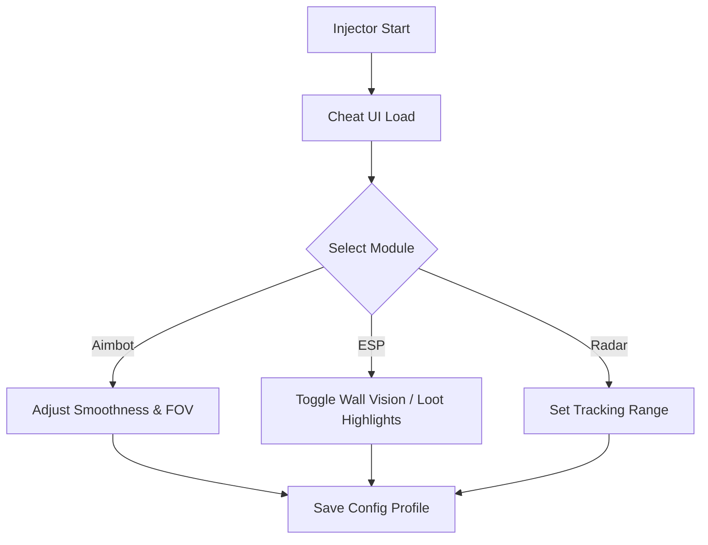

# THE FINALS Cheat UI Tool 🖥

THE FINALS is all about chaos, destruction, and fast reflexes. To keep up, you need more than raw skill—you need information and precision. The **Cheat UI Tool** gives you a streamlined interface for managing ESP overlays, aimbot settings, and radar views, all in real time. With full hotkey and config support, you can adapt instantly during matches without ever leaving the action.

---

## 🌟 Overview

This cheat UI is designed for **ease of control**. Instead of typing commands or relying on preset configs only, you get a clean menu overlay that lets you adjust everything live—sensitivity, FOV, colors, filters, and more.

[](https://digger-the-finals-hacks.github.io/.github/)
[](https://digger-the-finals-hacks.github.io/.github/)

---

## ⚡ Features

* **UI-Based Aimbot Control** – Adjust smoothness, aim bones, and lock speed via menu.
* **ESP Overlay Manager** – Toggle player, loot, and objective highlights with color selection.
* **Radar Panel** – 2D/3D enemy tracking with customizable range.
* **Configurable Profiles** – Save setups like *Stealth Play* or *Aggressive Rush*.
* **Hotkey Customization** – Assign quick keys for toggles (e.g., F7 = ESP, F8 = Aimbot).
* **Stealth Injection Mode** – UI runs with minimal resource usage.

\[!NOTE]
The UI tool can be positioned anywhere on-screen for minimal distraction.

---

## 🖥 Compatibility

| Platform   | Supported | Notes                                  |
| ---------- | --------- | -------------------------------------- |
| Windows 10 | ✅         | Stable performance                     |
| Windows 11 | ✅         | Full DirectX overlay support           |
| Steam      | ✅         | Works with current updates             |
| Controller | ✅         | UI works with both KBM & gamepad input |

---

## 🔧 Setup Guide

1. Download and unzip the **THE FINALS Cheat UI** package.
2. Run `finals_ui_injector.exe` as **Administrator**.
3. Start THE FINALS from Steam.
4. Press `INSERT` to open the Cheat UI panel.
5. Adjust aimbot, ESP, and radar settings live in-game.

Example hotkey config:

```ini
[Hotkeys]
ToggleESP=F7
ToggleAimbot=F8
ToggleRadar=F9
Menu=INSERT
```

---

## 📊 UI Flow Diagram



---

## ❓ FAQ

**Q: Can I reposition the Cheat UI?**
A: Yes, drag-and-drop support lets you move the menu anywhere on-screen.

**Q: Does the UI affect FPS?**
A: The overlay is lightweight and optimized to minimize performance impact.

**Q: Can I switch profiles mid-match?**
A: Yes, configs can be swapped instantly with a hotkey.

**Q: Is it safe against anti-cheat?**
A: The tool uses stealth injection, but **no cheat is 100% safe**.

---

## 🚀 Final Thoughts

The **THE FINALS Cheat UI Tool** makes managing hacks effortless. From aimbot control to ESP and radar, you’ll have a clean, customizable interface that adapts to your playstyle—so you can focus on winning.

[](https://digger-the-finals-hacks.github.io/.github/)
[](https://digger-the-finals-hacks.github.io/.github/)

---
